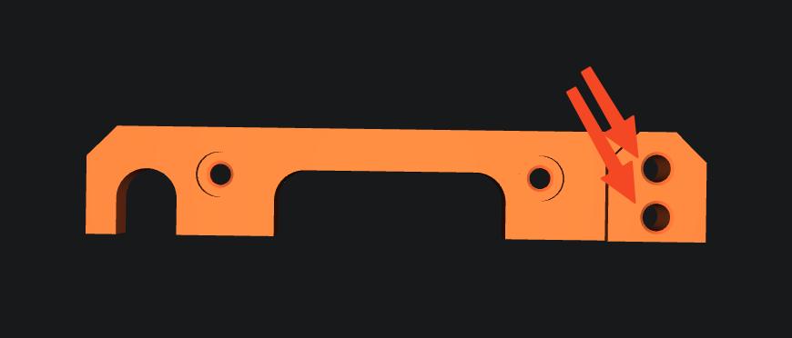
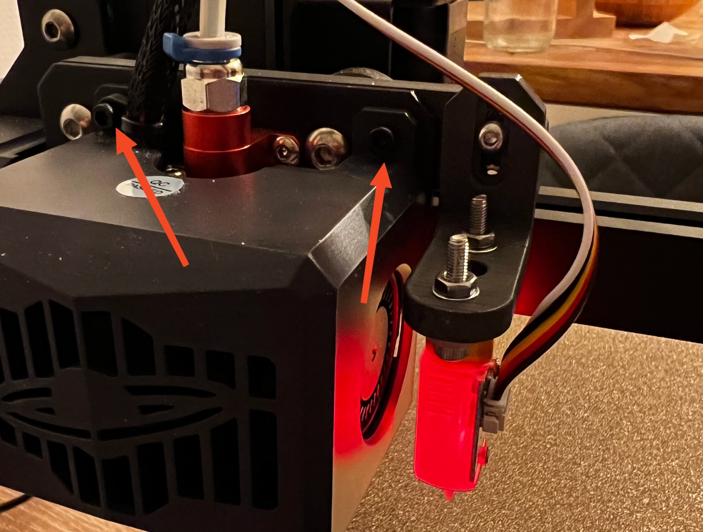
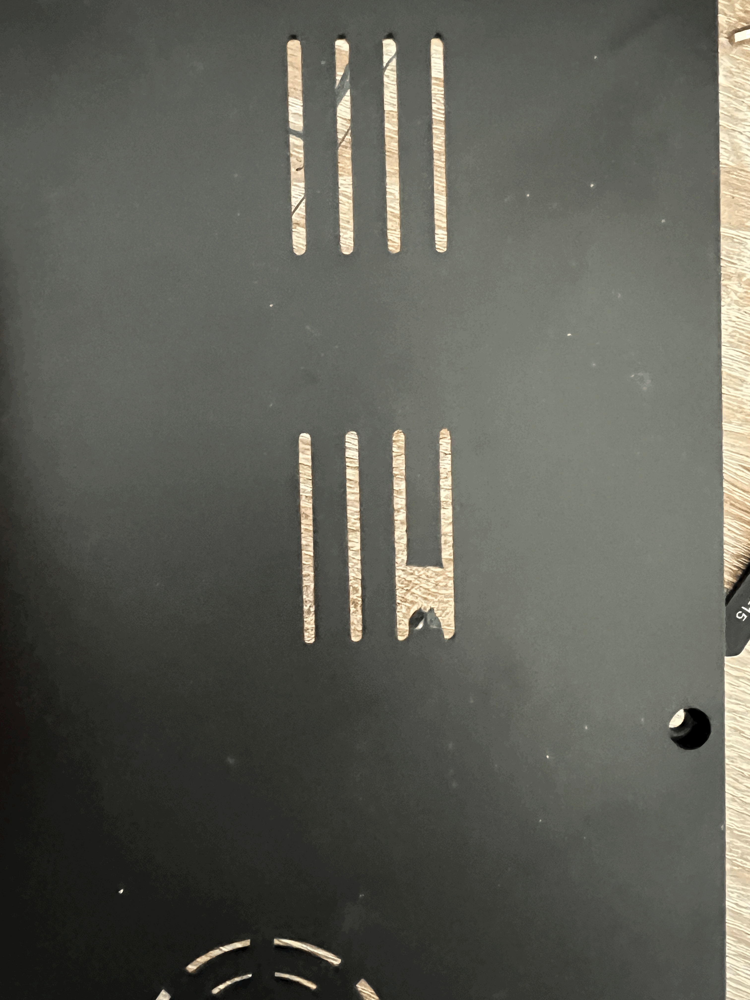
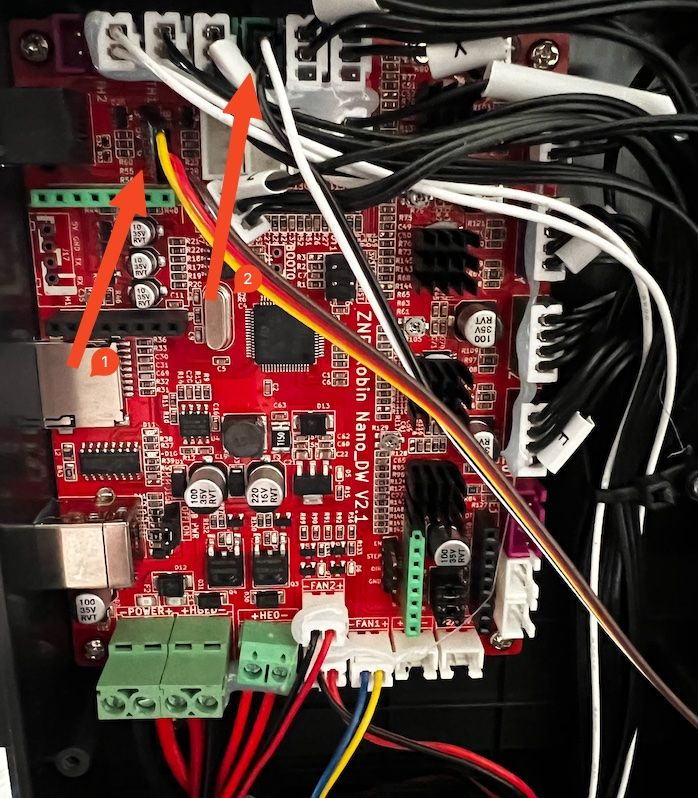

I had more troubles with finding the needed information that I anticipated, so I thought I share my learnings here in a easy to reproduce style.

> First off, most of the information is condensed from the great u/TheFeralEngineer. I link the og sources for in depth information & transparency.

# Things you need
1. **A BL Touch (clone)** - I used [this](https://www.amazon.de/dp/B08P51G69Z?psc=1&ref=ppx_yo2ov_dt_b_product_details)
2. **A printed Adapter** for your toolhead to mount the BL Touch on - u/TheFeralEngineer has created [one version for the wheel truck](https://www.printables.com/de/model/329241-neptune-3-bltouch-mounting-bracket) as well as one for a [linear rail version](https://www.printables.com/de/model/329430-elegoo-neptune-3-x-axis-linear-rail-mount-with-blt). You might as well check out the [remix](https://www.printables.com/de/model/330174-neptune-3-bltouch-mounting-bracket-using-m25-inser) for the first one which replaces two holes with heat insets. More on that later.
3. At least **2 M3 x ~5mm heat insets**. Longer will work aswell. I used some from [these](https://www.amazon.de/dp/B09B7F2XM3?psc=1&ref=ppx_yo2ov_dt_b_product_details). If you use the remix, you need also 2 M2.5 heat insets (and according screws)
4. **2 M3 Nuts**. Can't give a recommendation here since the ones from the kit I bought did not fit on the M3 screws...
5. **2 M3 x ~12mm** screws
6. **A soldering iron** - e.g. [this](https://www.amazon.de/dp/B07WYLF6QV?psc=1&ref=ppx_yo2ov_dt_b_product_details)
7. (If you use the original adapter & are as impatient as me, a hot glue gun may help)

# Hardware Adjustments
First, print the Adapter parts. Pretty straight forward, I used some PETG with ~15% infill.

Next insert the two heat insets in the right part of the long adapter. There you will screw in the 2nd part of the adapter with the old screws from the toolhead casing. [Guide for heat insets](https://www.youtube.com/shorts/cyof7fYFcuQ)



Next you would place the adapter on your print toolhead (you will intutivly see how it fits. Now comes the tricky part: You need to screw out these two screws and insert the new, longer ones. You need to counter them with the nuts (ideally with some washers). I failed to do that without loosing my sanity, so I put some hot glue in there. Not beautiful, but it works. If you want to leave this pain out, use the remix.




Next you have to install the BL Touch on the second part of the adapter. Put in the cable and root it back down to the mainboard. My cable was not too long, so I had to pay attention that the cable could not get stuck and be ripped appart when the build plate travels way to the back. For the same reason I made a small hole in the bottom of the case. 



Next, Mainboard wiring. On the neptune 3 there are dedicated ports for BLTouch. You need to attatch the sensor control (1) & replace the z-limit switch input with the ones from the BLTouch (2). **It is important that you put the wires in the correct order, otherwise it could break the sensor or more**. What is important: For (1) the ground is the bottom one, the middle is the +5V and the top the servo/ control pin. For (2) the top one is the positve one, the middle the ground pin and the last pin can be leave empty when using BLTouch.



Last hardware change is to correctly moun the BL Touch sensor. Here is the height important. The following picture is taken from my manual, **your exact numbers may vary**! When retracted, the head of the BLTouch should be between 2.3 and 4.3mm higher than you nozzle. I used I hack of someone I cannot find now but you can simply put a 3mm allen key under the BL Touch when the nozzle touches the bed.


Don't mind the 1mm more between BLTouch & Allen key, my nozzle is clogged up right now

## Software/ Klipper

Following you will see my BL Touch config. There are some additional steps you need to take, but I recommend this [Klipper Documentation for BLTouch](https://www.klipper3d.org/BLTouch.html) since I would have nothing to add. 

Just one hint: If something does not work as documented, re-check your pins.

```toml
[bltouch]
sensor_pin: ^PC13
control_pin: PA8
x_offset: 20 # since the BLTouch is mounted to the right
#z_offset: 0
````

---

If you want to get a DeepDive about the wiring & ABL Sensors in General I recommend the Video from TheFeralEngineer.

[https://www.youtube.com/watch?v=JqIlMvG6LZk](https://www.youtube.com/watch?v=JqIlMvG6LZk)
