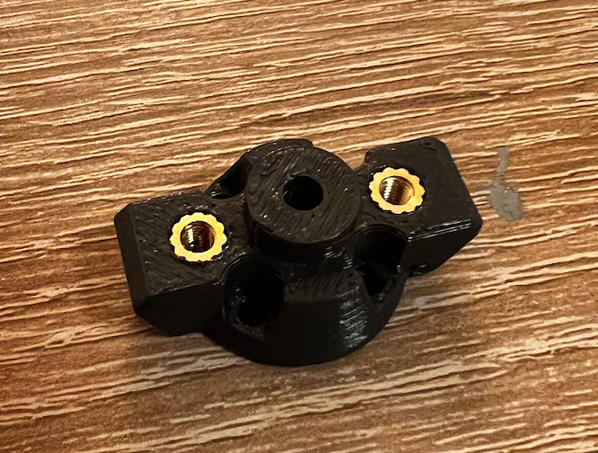
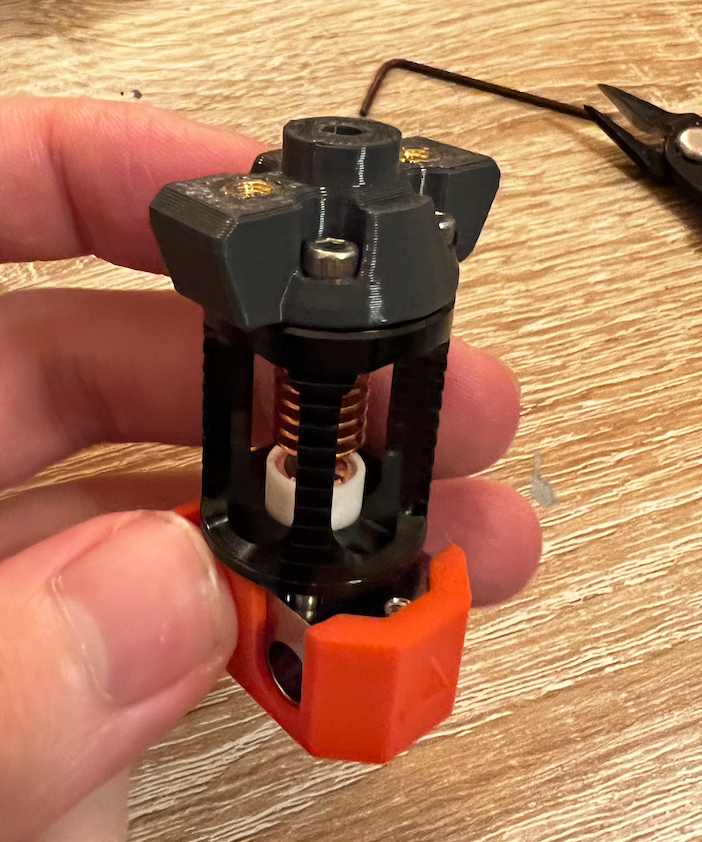
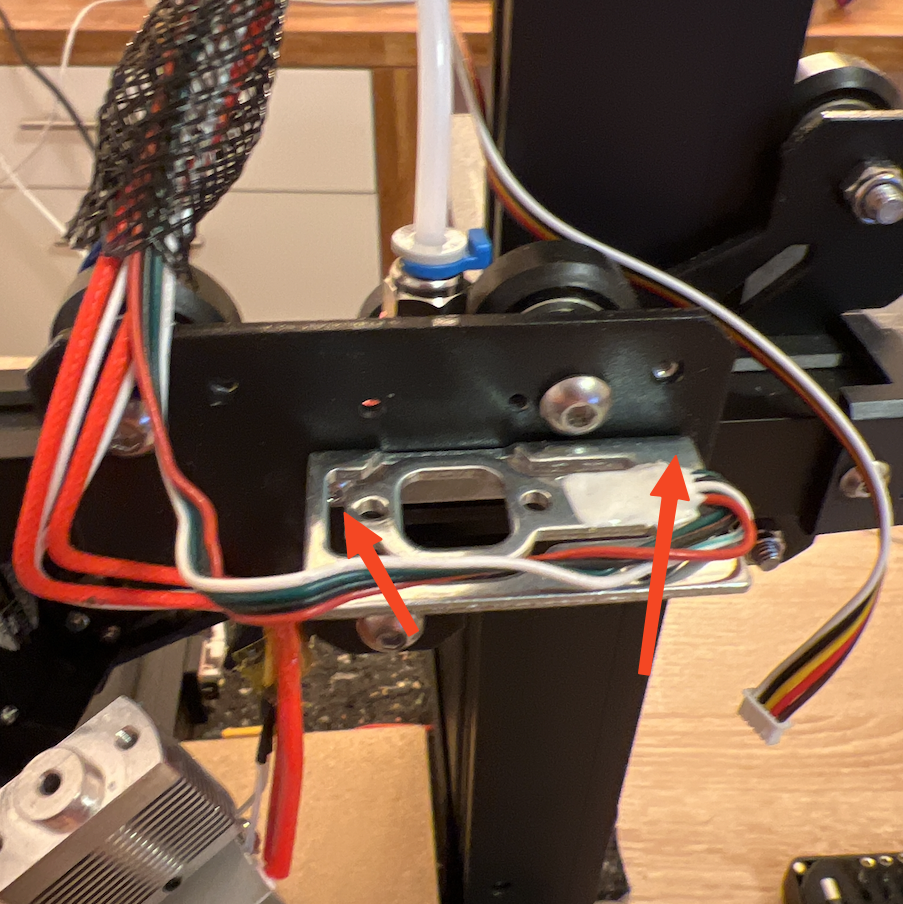
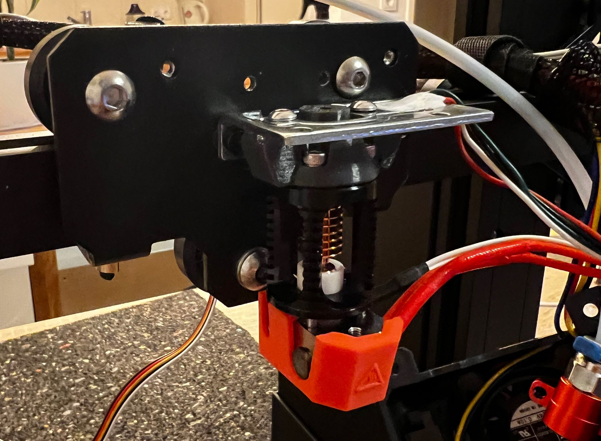

Detailed Instructions on how to upgrade your Elegoo Neptune 3 from the Stock Hotend to the Phaeteus Dragon Hotend (High Flow or Standard Flow)

import {Alert, AlertDescription, AlertTitle} from '@/components/ui/alert'
import {ShieldAlert} from '@lucide/astro'

<Alert variant="warning">
  <ShieldAlert />
  <AlertTitle>ATTENTION</AlertTitle>
  <AlertDescription>
    By following this guide, you will have a flaw in your cooling setup and will damage your stock fanduct! This is due to the "too long" stock heating cartrige which sticks out of the heating block. It will melt one side of the fanduct of one side. It still works, but the Airflow is probably suboptimal now.
    I do not have a fix for this in place right now, but probably will end up with a shorter heating cartrige. And another fanduct...
  </AlertDescription>
</Alert>

 

# Required Parts
* Some Filament for printing the adapter. I used this [PETG](https://www.google.com/search?client=safari&rls=en&q=extrudr+petg&ie=UTF-8&oe=UTF-8), but probably will replace it in some time with ABS/ ASA/ GreenTec Pro
* [Link to Printables](https://www.printables.com/de/model/369825-elegoo-neptune-3-dragon-hotend-adapter)
* 2 Brass heat insets M3, I used M3x6x5
* Some M3 Washers. You need to add space for 2 screws each aroung ~3mm
* A Dragon Hotend. I used a Pheateus one, in theory a Triangle-Lab one should work aswell
## Optional
* a new temperature sensor. The one integrated in the stock hotend can be reused since the Pheateus packaging includes a cartrige to put around the stock sensor (which is just a small "glass thing" with wires attatched. I broke mine, so had to get a new one..
* a new heating cartrige

# Installation

Print the Adapter [Part](https://www.printables.com/de/model/369825-elegoo-neptune-3-dragon-hotend-adapter). I used 60% infill. From the mechanic point it should work with the strain gauge Auto Bed Level sensor, but I did not test this. So keep this in mind!

After this, you can mount the part to the dragon hotend after unscrwing the old bowden connector from below. The screws are included in the Pheateus packaging.

Unscrew your toolhead until this stage. Put the washers between the metal part which holds the hotend and the black backplate fixed by the 2 screws on the arrows.

Now you can install the adapter like this. Here you can also see the above described problem that the heating cartrige stands out of one side.

The old bowded setup fits perfectly on Top.

And now evyerthing left is to wire the cables around & put the fan enclosure back. DONT FORGET TO PID TUNE AFTER THE HOTEND INSTALLATION.

So far I printed ~12h with this setup and everything works fine. 

Happy printing 🎉
