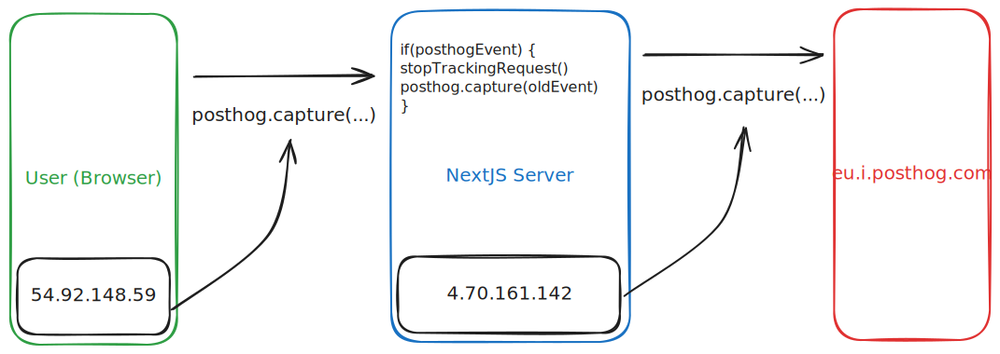

Tracking your products is an integral part of improving your users experience and ensure a healthy development. Since most tracking tools are US based where GDPR is not as important as in the european union, it can be tricky to get started. Opposite to common belief, if you do some adjustments it is also possible to use tools like posthog without the consent of the user!

# Tracking without users consent? How dare you!

Hold your horses. In the [first paragraph](https://dsgvo-gesetz.de/art-1-dsgvo/) of the german implementation of the GDPR (DSGVO) it is stated: 

> This Regulation lays down rules to protect natural persons with regard to the processing of personal data and to ensure the free movement of such data.

Notice the "personal data" in there. [Personal data describes](https://dsgvo-gesetz.de/art-4-dsgvo/) every kind of data which can be attached to natural human beeing, e.g. names, location data, medical information etc. So what does that mean in our engineering context? email-adresses, birth dates, location data, etc. All of this is information from a natural human beeing. 

For the case of product analytics we (mostly) dont care about this information. I want to know how my users use the tool and identify specific areas for improvement. Therefore I want to track pageviews, clicks, interactions with forms, dead clicks. All of this data by default does not contain any personal data, it is not attachable to a direct human. When we want to use any of this data, is it very simple: The GDPR does not apply to us! We (and the tools we might be using) do not process any personal data! Therefore we don't need any consent

But we have to make sure to stick to some patterns to prevent us from getting such personal data by accident!

## emails and other persistent identifiers

If you have a product which uses logins and therefore probably has access to emails and names, you need to have some form of consent during the signup anyway. Still you should make sure you use the personal data as rarely as possible/ needed to prevent accidental leaks.

Tools like posthog imply in their docs that you should [attach the email](https://posthog.com/docs/product-analytics/identify) to your user profile while identifying. While you can do this, you have to put in additional efforts in your data privacy and consent banner. Posthog is not a data-processor. Posthog has a EU based hosting which makes it easier, but for us-hosted tools this can get [quite painful](https://dsgvo-gesetz.de/kapitel-5/).

Therefore the easiest solution: *use the hashed email address of the user!*

Note: For tools without Logins it is easier: You can generate persistent identifiers in your application. When you dont have any personal data attached to this user, it is just a random id. Regardless of how much click events or similar you track, there is no way to identify a natural person with it!

## IP Adresses

This one is the most overlooked one: Couple of years ago there was a [famous ruling in germany](https://www.cookieyes.com/documentation/google-fonts-and-gdpr/) that using Google Font Embeds is not GDPR compliant. The reason? While requesting the font from a google server, google gets access to the IP address of the user requesting the font. This cannot be prevented, it is just the way how HTTP requests and servers work. This means, every http request from the users browser to a tracking tool like posthog, posthog has access to the IP address. And since we cannot guarantee they don't store it somewhere (in fact, it gets attached by default to a user profile), this is a problem.

No way to prevent it? 

There is one. Glorious Reverse Proxy!

By proxying the requests to your own server upfront

### Setting up Reverse Proxy as Next.js Middleware

Recently I worked on some Next.js app where we wanted to implement GDPR compliant posthog tracking. We stumbled upon [this help article](https://posthog.com/docs/advanced/proxy/nextjs-middleware).

In this simplified schematic you can see how the flow of tracking events is with the Reverse Proxy setup.

1. In your code you call posthog.capture directly. This will submit an HTTP request to your reverse proxy. Since your Reverse Proxy is your nextjs webserver, which has access to the IP adress either way. Due to the way HTTP Protocol works, your own first-party server needs access to the IP address for providing the service, so no consent needed for that.
2. When your nextjs server detects the http request for a posthog.capture event, it basically stops the request which would normally go to eu.i.posthog.com. It copies all of the contents and fires the request from the nextjs server as a seperate HTTP request. Again, due to the nature posthog has access to the IP adress, but now the IP adress from our nextjs server. Not the IP adress from the user anymore!
3. You can check in posthog for any person the IP adress. It should now be always the same and all should match the one from your nextjs server 🎉

