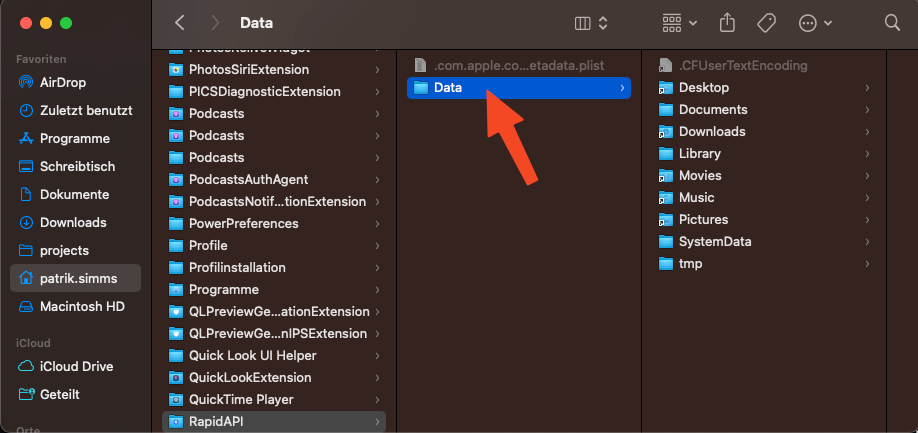
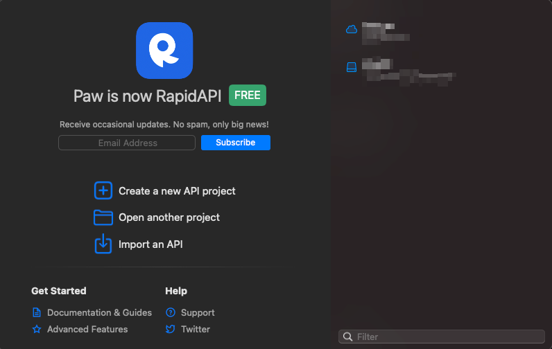

[Paw](https://paw.cloud/) (nowdays called RapidAPI) is a pretty advanced HTTP client for macOS. It combines the features of [Postman](https://www.postman.com/) and [Insomnia](https://insomnia.rest/) into a native Platform App (so no electron 🎉) which looks & feels like Apple would have developed it (in the good and the bad parts..).

I had the issue that out of the blue Paw did not open a window anymore, so it was not beeing usable. Restarting the app & the mac did not help. I found no known bugs or ways to fix this, thats why I put my fix here:

Close Paw & Open your finder
Navigate to your user home folder
Show hidden folders (cmd + shift + .)
Go To Library -> Containers -> RapidAPI
Delete the "Data" Folder. This will delete the caches for PAW
Reopen Paw. You should see a window where you can again select a project, like on your first startup. You might need to login again

Delete this folder

Initial Startup window for Paw
Done. Everything should work as before 🎉
