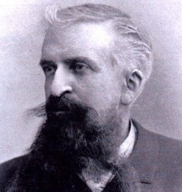

The Frenchman Gustave Le Bon was a French physician and sociologist who, in 1911, attempted to explain social “masses” in a comprehensible way with the publication of “The Psychology of Crowds.” In his work, he collects observations and deductions on how mass dynamics made events such as the French Revolution possible. Based on his work, we will attempt here to make the current problems of general communication in Germany understandable and comprehensible, and explain why we are unable to reach lateral thinkers in this way. 

# What are masses?

> Under certain circumstances, and only under these circumstances, a gathering of people possesses new characteristics that are quite different from those of the individuals who make up that society.

With these words, Le Bon describes a psychological crowd. Crowds are not exclusive or engaging, but always form under certain “circumstances.” For example, in the morning you may belong to the crowd of frustrated wage workers at a large corporation, but in the evening you may belong to the crowd of BVB soccer fans. Crowds do not have to physically gather in one place. It is enough for them to form a “psychological unity.”

The special thing about masses is that the individual desires, needs, and personalities of their members are subordinated to the common feeling of the mass. While an individual still has differentiated views, these completely dissolve in psychological masses, provided that this “differentiation” is not a characteristic of the mass soul itself. 

# Why does current mass communication not work?

According to Le Bon, crowds are completely incapable of following logical arguments. Even the best presentation of arguments is usually completely inaccessible to crowds. This may be confusing, as in direct conversations with individuals, this is generally considered the best way to convince people. However, as already mentioned, distinctions and personal feelings completely dissolve in crowds.  

Even though lateral thinkers today are only sometimes physically united in one place, they can still be classified as a crowd, as mentioned above. The current consensus of “convincing” as many people as possible to get vaccinated or confronting lateral thinkers with logic is therefore often doomed to failure before it has even been attempted. 

In his work, Le Bon emphasizes that there are indeed ways to control crowds. They consist of three steps:

1. **The assertion**
An assertion represents the origin of an idea used to convince a large group of people of something. It does not need to contain any evidence; on the contrary, the more definitive it is, the more persuasive it is. An assertion would be, for example, “We live in a dictatorship” or “HSV is the best soccer club in the world.” Evidence is often even a hindrance, as it dilutes the clarity of the statement.
2. **Repetition**
This is where the actual persuasion begins. Through continuous repetition, these claims become embedded in the subconscious. Such means of cognition are well [documented today](https://www.die-bonn.de/doks/lemke0301.pdf). Due to this effect in the brain, logical reservations become irrelevant over time. Le Bon gives a simple example here: if we see an advertisement from a chocolate manufacturer claiming that their chocolate is the best a hundred times, after a while we imagine that we have seen and heard this statement many times and, due to the sheer volume of advertisements, assume that it must be true or will be true. Over time, our perception becomes increasingly blurred and the manufacturer's statement, “My chocolate is the best,” becomes “This chocolate is the best.” It is important to note that only contradictory information has the power to prevent this impression from becoming embedded in the subconscious, but even then only if it is repeated sufficiently often. “Assertion and repetition alone are powerful enough to combat each other.”
3. **Transmission or contagion**
If a claim is repeated often enough and unanimously, the idea transforms into a “mental current.” At this stage, it is primarily the masses themselves who propagate the idea or statement and impress it upon their peers. Imitation also plays a role, because when enough people in a crowd carry and convey a certain idea, less integrated members pick it up and reproduce it. Here, Le Bon mentions: “It is not with reasons that one leads the masses, but with examples.”

When comparing this to general communication today, it is striking that there is a constant emphasis on science providing the evidence on which politicians base their decisions. The problem with this communication is obvious: science is characterized by its diversity. Evidence is often not as clear-cut and universally valid as one might wish. This is something that, according to the three steps mentioned above, tends to be more of a hindrance than a help when it comes to convincing the masses. 

# Criticism of the scientific method

From today's perspective, especially if you have recently written a major scientific paper, Le Bon's work is very unscientific. His argumentation is mostly based on examples, of which he claims there are “quite a few.” He describes his work as objective because it is based purely on “observations.” It seems a little strange, as sources are cited only in a few exceptions and no statistically relevant experiments or similar data collected by the author himself are mentioned. 

This leaves the impression that, although all his statements may be true and much of it is apparently recognizable in our current situation, this is not proof in the scientific sense. The danger of being misled by the “findings” in this book is therefore high (“Oh yes, I see it that way too at the moment,” keyword: [confirmation bias](https://www.br.de/nachrichten/netzwelt/confirmation-bias-warum-uns-fakten-so-schwer-ueberzeugen,SNUD9gu)).

This work (and thus also this text) should rather be seen as an interpretation of a theory that is very coherent in itself, but poorly substantiated scientifically by the work itself. With extensive research, much could probably be substantiated with cognitive science, psychological, and sociological statistics, but that should be left to those who have the necessary prior knowledge in these fields of research.

# What can we learn from this?

Even though current communication about the coronavirus is logical and rational, it fails to reach a very specific group: the contrarians. In a way, they can certainly be criticized for having no intrinsic interest in facts and logical conclusions. On the other hand, we cannot afford to ignore this group of people because of this. Le Bon's observations on mass behavior speak for them and against us. While contrarians say, “You will die from the vaccine,” we present them with statistics showing that “only a very small number of people develop potentially fatal cerebral venous thrombosis under certain circumstances.”

That may all be true, but it is not a claim that appeals to the masses. It is repeated often enough, and the majority of those who have been vaccinated do not actively share their knowledge. Many are more concerned with their own problems or are tired of repeating themselves. And that is understandable. But if we don't at least consider how we can communicate differently so that those who think differently receive at least enough contrasting information, then we run the risk of not solving this problem in the coming years. Over 100 years ago, Le Bon provided an explanatory approach to mass psychology that has the potential to communicate with all masses.

[**The Book**](https://www.nikol-verlag.de/psychologie-der-massen-leinen-mit-goldpragung)
