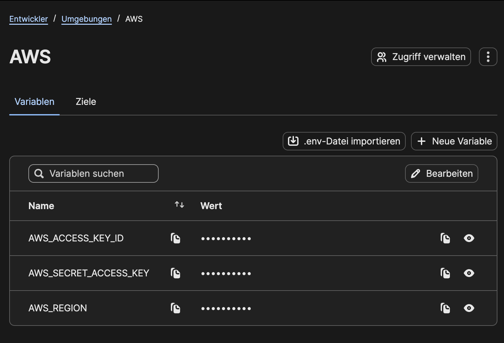

import Alert from "@/components/ui/Alert.astro";
import { ShieldAlert } from "@lucide/astro";

> There is no 100% security, this is not a guarantee that attackers steal your AWS credentials! It is about reducing the most obvious attack vectors. 

<Alert variant="warning" title="Jump to solution">
  <ShieldAlert slot="icon" />
  <p>
    If you already know the problem, jump directly to the{" "}
    <a class="a" href="#op-1password-cli">1Password CLI solution</a>
    {" "}or the{" "}
    <a class="a" href="#aws-vault">aws-vault solution</a>.
  </p>
</Alert>

Couple of weeks ago we rolled out codex for every developer at [esome](https://www.esome.com/de/digital-marketing-solutions/). I have been a heavy user since begining of the year and it was only natural to do a Q&A Session with other heavy users and for those who only got introduced to the style of LLM usage.

What I did not expect: Most of the questions were about security.

* How do you make sure that the LLM does not get access to API keys/ credentials?
* How do you make sure code you did not read does not manipulate something with your AWS credentials?
* How do you make sure you don't install skills that contain malicious instructions?

During the meeting I mostly answered with "did not care about it, used yolo mode all the time". But it got me thinking for a solution and I think I found one for my workflow, which at least covers the most obvious attack vectors.

## The problem

By default, AWS credentials are stored in plain text in `~/.aws/credentials` file. As long as codex/ claude code is allowed to execute arbitary bash commands, a small malicous text in a skill you install could lead to a command executed that reads the content of the file and POST-ing it somewhere with curl. Couple of seconds, credentials gone.

Depending if you were able to spot the command beeing executed, bac actors could do all kind of things depending on the permissions your AWS user has. 

Therefore we want to:
* prevent the credentials stored in plain text all the time
* prevent the credentials stored temporaily in a file over multiple shells
* grant permissions manually every time AWS credentials are accessed
* should work for accessing AWS APIs like bedrock/ textract locally for development

## The solution

There are several options for not storing AWS credentials in plain text. All of them revolve somehow about a keychain-like secure backend, depending on your OS. I started with [aws-vault](https://github.com/ByteNess/aws-vault) which uses macOS keychain, but quickly got annoyed due to buggy/ not working touch ID. And no way I am going to enter my keychain password manually every time my agent wants to access kubectl for debugging an issue. I will still attach relevant scripts for aws-vault below.

Since I use [1password](https://1password.com/de) for my private stuff, I checked it out and they have a [first-party plugin](https://www.1password.dev/cli/shell-plugins/aws) for working with aws-cli. 

## op (1password CLI)

* Install CLI & aws-cli extension [https://www.1password.dev/cli/shell-plugins/aws](https://www.1password.dev/cli/shell-plugins/aws)
* back up your `.aws/credentials` file
* delete your `.aws/credentials` file to make op is the only source of access later on
* Follow setup in [https://www.1password.dev/cli/shell-plugins/aws](https://www.1password.dev/cli/shell-plugins/aws)
* test op CLI with aws: `aws sts get-caller-identity --profile <prod>`. You should get promted with a touch ID modal for accessing aws credentials

### kubectl
When accessing k8s via aws, you need top update your `~/.kube/config` to request credentials from op secret storage

```yaml
apiVersion: v1
clusters:
- cluster:
    certificate-authority-data: xxx
    server: https://xxx.eu-central-1.eks.amazonaws.com
  name: arn:aws:eks:eu-central-1:xxx:xxx/xxx
contexts:
- context:
    cluster: arn:aws:eks:eu-central-1:xxx:xxx/xxx
    user: arn:aws:eks:eu-central-1:xxx:xxx/xxx
  name: xxx
current-context: xxx
kind: Config
users:
- name: arn:aws:eks:eu-central-1:xxx:xxx/xxx
  user:
    exec:
      apiVersion: client.authentication.k8s.io/v1beta1
      args:
      # this is the relevant section you have to update in your config
      - -lc
      - exec op plugin run -- aws --region eu-central-1 eks get-token --cluster-name eks01-prd --output json
      command: zsh
      env:
      - name: AWS_PROFILE
        value: prd
      interactiveMode: IfAvailable
      provideClusterInfo: false
```

### Application credentials (nodejs)
If your locally running service you are developing needs access to AWS resources, e.g. AWS Bedrock, this whole thing might break apart. Your application does not know about a shell or the created alias from 1password. 

In these cases you can use 1password environments.


* Create an environment in 1password with these 3 env vars
* Create methods for authenticating in production (via IAM roles) and locally (via environment variables)
* Keep in mind: if you are assuming IAM roles locally, you need wrap it into `fromTemporaryCredentials` provider, using the correct role
* Copy environment-ley from 1password interface at 3dots -> Copy environment ID
* You can start applications with `op run --environment xxx -- bun run dev`

```ts
import { fromNodeProviderChain, fromTemporaryCredentials } from '@aws-sdk/credential-providers';
import type { AwsCredentialIdentity, Provider } from '@aws-sdk/types';

interface AwsCredentialOptions {
    accessKeyId?: string;
    secretAccessKey?: string;
    sessionToken?: string;
    profile?: string;
    region?: string;
    roleArn?: string;
    roleSessionName?: string;
}

// Local static env credentials need to assume the DevOps role before calling Bedrock.
const buildAssumeRoleCredentialProvider = ({
    masterCredentials,
    region,
    roleArn,
    roleSessionName,
}: {
    masterCredentials: AwsCredentialIdentity | Provider<AwsCredentialIdentity>;
    region?: string;
    roleArn: string;
    roleSessionName?: string;
}): Provider<AwsCredentialIdentity> =>
    fromTemporaryCredentials({
        masterCredentials,
        params: {
            RoleArn: roleArn,
            RoleSessionName: roleSessionName ?? 'xxx',
        },
        clientConfig: region ? { region } : undefined,
    });

const buildStaticCredentials = ({
    accessKeyId,
    secretAccessKey,
    sessionToken,
}: Required<Pick<AwsCredentialOptions, 'accessKeyId' | 'secretAccessKey'>> &
    Pick<AwsCredentialOptions, 'sessionToken'>): AwsCredentialIdentity => ({
    accessKeyId,
    secretAccessKey,
    ...(sessionToken ? { sessionToken } : {}),
});

export const buildAwsCredentialProvider = ({
    accessKeyId,
    secretAccessKey,
    sessionToken,
    profile,
    region,
    roleArn,
    roleSessionName,
}: AwsCredentialOptions = {}): Provider<AwsCredentialIdentity> | undefined => {
    if (accessKeyId && secretAccessKey) {
        const credentials = buildStaticCredentials({
            accessKeyId,
            secretAccessKey,
            sessionToken,
        });

        if (roleArn) {
            return buildAssumeRoleCredentialProvider({
                masterCredentials: credentials,
                region,
                roleArn,
                roleSessionName,
            });
        }

        return async () => credentials;
    }

    if (profile) {
        return fromNodeProviderChain({ profile });
    }

    return fromNodeProviderChain();
};

export const buildAwsClientCredentials = buildAwsCredentialProvider;

```

## aws-vault

* Follow Setup guide [here](https://github.com/ByteNess/aws-vault)
* * back up your `.aws/credentials` file
* delete your `.aws/credentials` file to make op is the only source of access later on
* test aws-vault credentials: `aws-vault exec <prod> -- aws sts get-caller-identity`

### kubectl
When accessing k8s via aws, you need top update your `~/.kube/config` to request credentials from op secret storage

```yml
apiVersion: v1
clusters:
- cluster:
    certificate-authority-data: xxx
    server: https://xxx.eu-central-1.eks.amazonaws.com
  name: arn:aws:eks:eu-central-1:xxx:xxx/xxx
contexts:
- context:
    cluster: arn:aws:eks:eu-central-1:xxx:xxx/xxx
    user: arn:aws:eks:eu-central-1:xxx:xxx/xxx
  name: xxx
current-context: xxx
kind: Config
users:
- name: arn:aws:eks:eu-central-1:xxx:xxx/xxx
  user:
   exec:
      apiVersion: client.authentication.k8s.io/v1beta1
      # this is the relevant section you have to update in your config
      args:
      - exec
      - prd
      - --
      - aws
      - --region
      - eu-central-1
      - eks
      - get-token
      - --cluster-name
      - xxx
      - --output
      - json
      command: aws-vault
      env:
      - name: AWS_PROFILE
        value: prd
      interactiveMode: IfAvailable
      provideClusterInfo: false
```

### Application Credentials (nodejs)
There seems to be a way to integrate docker with aws-vault, but it seems a rather complex setup, did not try it yet:
[https://github.com/ByteNess/aws-vault/blob/main/USAGE.md#docker](https://github.com/ByteNess/aws-vault/blob/main/USAGE.md#docker)
