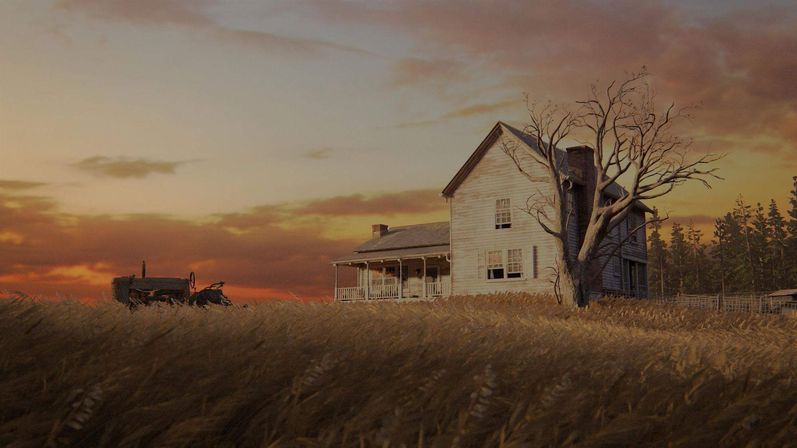

Claiming that something is the “best” is always a difficult statement to make. Especially with this game, which has been received more differently than almost any other. For those who were emotionally affected by it, it is a masterpiece. For others, it is hell. For me, it was both.

---

First things first: claiming that something is the “best” is always a difficult statement to make. Especially with this game, which has been received more differently than almost any other. For those who were emotionally affected by it, it is a masterpiece. For others, it is hell. For me, it was both. 

*Disclaimer: I would say that you can read the following without being spoiled about Part I and Part II. But since everyone sees things differently, consider yourself warned.*

# What distinguishes a game from a movie?

Video games are considered an interactive medium. It is often argued that the ability to make decisions is the distinguishing feature between films and video games. Games such as [Minecraft](https://www.minecraft.net) or [Star Citizen](https://robertsspaceindustries.com) are good examples of games that take this freedom to the extreme. These games can tell stories in a way that a linear medium such as film never could. On the other hand, games such as [The Witcher 3](https://store.steampowered.com/app/292030/The_Witcher_3_Wild_Hunt) or [Papers Please](https://store.steampowered.com/app/239030/Papers_Please) present players with difficult moral decisions that many players remember. Many claim (and I include myself in this) that it is precisely this freedom of choice that leads to a special gaming experience. When you turn away a father at the border to Arstotzka, the country where you play a border guard in Papers Please, who has been separated from his family in order to survive (as a border guard), it is a memorable moment.

> But is this really because one had a “choice”?

I'm not so sure anymore. For those who haven't recognized it from the thumbnail, this is about The Last of Us Part II. A game in which you have zero freedom of choice. Really, the story is 100% linear, and even in moments where experienced players think, “I MUST have a choice here” (cue the boat), you don't. But never before have I been so emotionally moved by a digital medium as I was here. And I am convinced that only a game could achieve this, despite its lack of freedom of choice.

I now believe that it's not about making a decision yourself, but rather about “experiencing” a decision. In The Last of Us Part II, you experience the story from Ellie's perspective. You experience her story. It's not about how the player feels about certain things, but how Ellie feels about them. The unique thing that Part II achieves is the incredible closeness to Ellie. We've already accompanied her through an entire game and taken her into our hearts. In the first quarter of the game, there's an event that deeply affects Ellie. I guarantee that everyone who experiences this scene will feel the same way as Ellie. My tip: take some time afterwards to think about how you feel and why. For me, this was the moment when I realized that I was playing an extraordinary game.

# Are video games fun?

It seems intuitive, really. And in 50% of cases, that's true. In 49.9% of cases, the games aren't fun because they're just bad. And then there's 0.1% of games that rethink the concept of “fun” and “entertainment.” Another good example, in my opinion, is [This War of Mine](https://store.steampowered.com/app/282070/This_War_of_Mine). 

However, I would like to qualify that statement. The gameplay in Part II is fun. It's not so good that it could carry the game on its own, but at least it's not annoying when a “gameplay sequence” comes up. And the story also has moments that are fun. Even incredibly fun (keyword: space).

However, there are also moments that are absolutely no fun. Two moments in particular stuck in my mind. Suffice to say: after a climax roughly halfway through the game, the perspective from which you view the game changes. There are many compilations of this event on YouTube in particular, in which a lot of people quit the game (at least temporarily) because they don't feel like playing what comes next. 
And then there's that one battle at the end of the game. I've never played a battle in which I suffered more. It sounds blunt and contrived, but I found it difficult to press every button. I didn't want to win or lose. I didn't want this battle. 

There are people who say:

> A game has to be fun, otherwise why would I play it?

This was one of the main criticisms of Part II. It was said to be “too dark.” While Naughty Dog can be accused of provoking precisely this expectation, I consider the argument that “games must always be fun” to be outdated. There are other things a game can trigger that are not just about fun and passing the time. This has long been common practice in film; I think very few people would claim that “Schindler's List” is an entertaining or even fun movie. I think it's time for this to be accepted for games as well. 

# Art cannot (and must not) appeal to everyone.

There has rarely been a game that has been as controversial as The Last of Us Part II. Hardly any other game has had such a large discrepancy between critics and players at release. At its lowest point, the game had a user score of 3.4 compared to a critic score of 9.5. The game has since settled at a user score of 5.7.

So it seems that a large proportion of players don't like the game. Why is that? I don't want to go into the proportion of reviewers who have a problem with the characters' sexual orientations or who were bothered by the leaks or Neil Druckman's reactions to them. 
However, Naughty Dog can be accused of poor “expectation management.” Players who played the first part and expected a sequel in the same vein may feel offended. However, I would say that this is precisely what allows the game to unfold its full effect. Players who have played the game will know what is meant by the keyword “The Lodge.” Very few expected what happens there. I can completely understand that many players don't like this. And I didn't like it either. Personally. But when I took a few minutes to think about it afterwards, I realized how much it had moved me. 

And that's what makes the game so unique for me. No other game has managed to achieve this to the same extent. And I would hope that the game works the same way for every player as it does for me. 

Nevertheless, I find statements such as “The Last of Us Part II is a bad game” or similar difficult and, above all, unfair. I am convinced that for players who were not as captivated by the story as I was, the game simply did not “work.” With his game, Neil Druckman took the risk that this type of game would not trigger the emotions that the game is supposed to trigger for many people. But that's exactly where art begins, in my opinion.

Art makes you think, art moves you. And art can't and, above all, doesn't *have* to appeal to everyone. And it's precisely this principle that comes into play in Part II. Neil Druckman and Naughty Dog knew that not everyone would like this game. And that's all the better for some. And I'm glad I got to have this experience.

# Closing Thoughts 

When a game manages to lead the player to a point where they no longer want to continue playing (through the things they have experienced and done as a player), then in my eyes it is something very special. For me and many others, this game has achieved exactly that. And for just as many others, it has not. While it is completely normal and accepted in films and music that certain pieces are a no-go for others, the outcry surrounding Part II shows that video games mostly try to reach the masses and it is noticeable when this is not the case. I just hope that there will be more games like The Last of Us in the future. Because with Part II, the medium of gaming has, in my opinion, earned a piece of art that will be hard to match for a long time to come. 

At least for me. 

